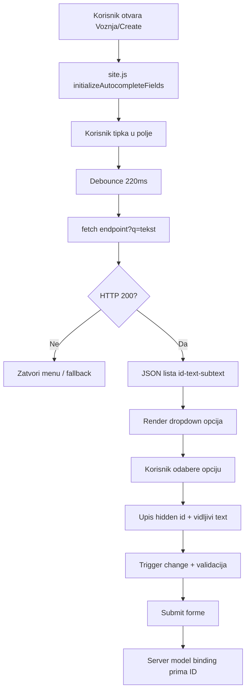
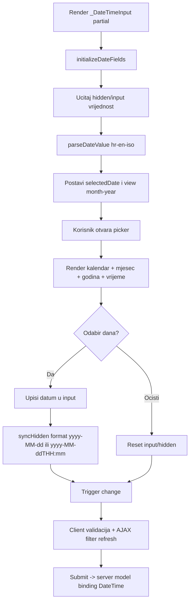
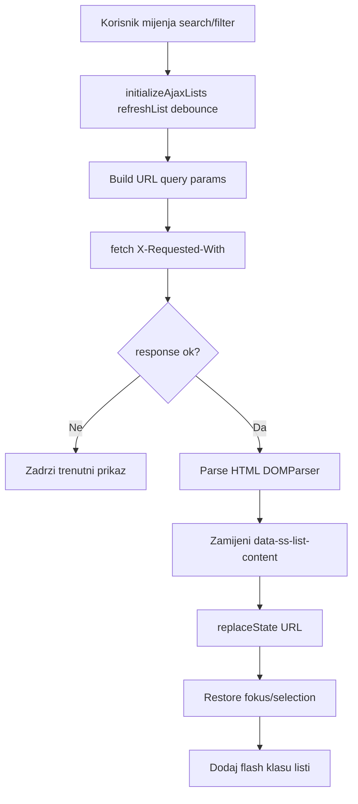

# Vodič za Lab 4 - CRUD, validacija, AJAX i datumske kontrole

Ovaj dokument služi kao priprema za usmeno i kao sažetak implementacije svega što je traženo u **Lab 4** za projekt **SideSeat**.

---

## 1. CRUD podrška za sve entitete
U Lab 4 fokus je bio da svi ključni entiteti imaju stabilan i funkcionalan CRUD tok (pregled, pretraga, detalji, unos, uređivanje, brisanje), uz poštivanje poslovnih pravila.

### Što je pokriveno
- `Index` stranice s listama i filtriranjem.
- `Create` i `Edit` forme s validacijom i prikazom poruka.
- `Delete` tokovi s potvrdom i sigurnim rukovanjem relacijama.
- `Details` prikazi s povezanim podacima (npr. ocjene, rezervacije, vozač/putnik kontekst).

### Tehnički naglasci
- Controller akcije su odvojene za `GET` i `POST` tokove.
- Validacija se provjerava kroz `ModelState.IsValid` prije spremanja.
- Kod edit scenarija koristi se dohvat postojećeg zapisa pa mapiranje dopuštenih polja.

---

## 2. AJAX autocomplete dropdown (custom kontrola)
Lab 4 zahtijeva custom dropdown s pretragom preko servera, bez oslanjanja na jednostavne statičke select kontrole za velike skupove podataka.

### Implementacijski obrazac
- Reusable partial: `_AutocompleteLookup.cshtml`.
- JS ponašanje centralizirano u `wwwroot/js/site.js`.
- Endpoint contract: `q` query + JSON shape `{ id, text, subtext }`.

### Što kontrola radi
- Tipkanje pokreće AJAX dohvat rezultata.
- Odabir stavke upisuje `id` u hidden polje, a tekst u vidljivi input.
- Rukuje praznim unosom, greškom servera i prefilled vrijednostima na edit formama.
- Radi i nakon partial/AJAX reloada (ponovna inicijalizacija hookova).

---

## 3. Validacija (client + server)
Validacija je izvedena na obje razine, što je obvezni dio vježbe.

### Client-side validacija
- Validacija se okida i na `blur` (gubitak fokusa), ne samo na submit.
- Prikaz poruka je stilom uklopljen u postojeći UI.
- JS kontrole (autocomplete/datetime) sinkroniziraju vrijednosti da unobtrusive validacija vidi ispravno stanje.

### Server-side validacija
- Svaki `POST` endpoint dodatno validira ulazne modele.
- U slučaju greške vraća se isti view s porukama i sačuvanim korisničkim unosom.
- Poslovna pravila i permission provjere su na serveru, ne samo na klijentu.

---

## 4. Naprednije korištenje JavaScripta
Lab 4 traži funkcionalne animacije i napredniji JS koji ima praktičnu svrhu.

### Primijenjeni principi
- Data-atribut hookovi (`data-ss-*`) za konzistentnu inicijalizaciju komponenti.
- Event delegacija i re-bind nakon AJAX osvježavanja listi.
- Zaštite od runtime grešaka (`null` guardovi, fallback ponašanja).
- UX ispravci: stabilizacija refresha listi, page-size ponašanje, fokus i odabir.

### Cilj animacija
- Animacije su u službi čitljivosti i prijelaza stanja, bez nepotrebnog "flash" efekta na svakom AJAX refreshu.

---

## 5. Datumska kontrola (datum + vrijeme) preko partial view-a
Ovo je ključna točka Lab 4: custom datetime kontrola bez native browser datepicker-a.

### Zahtjevi koji su pokriveni
- Kontrola je napravljena kroz partial: `_DateTimeInput.cshtml`.
- Koristi JS popup kalendar (mjesec/godina navigacija + odabir datuma).
- Nije korišten `input type="date"` kao osnovna kontrola.
- Primijenjena je na mjestima gdje se unosi/filtrira datum.

### Lokalizacija (hr/en)
- Prikaz i parsiranje datuma prate kulturu preglednika (`hr` / `en` scenarij).
- Hidden vrijednost se mapira u server-friendly format za pouzdan model binding.
- Podržani su create/edit roundtrip scenariji.

---

## 6. AJAX pretrage na listama
Svaka lista podataka treba imati asinkronu pretragu bez punog reloada stranice.

### Što je bitno
- Pretraga i filteri (uključujući datum gdje postoji) šalju se kroz AJAX.
- Rezultat osvježava samo listu, ne cijeli layout.
- Zadržava se stanje filtera (npr. page-size) nakon osvježavanja.
- Kontrole ostaju funkcionalne i nakon više uzastopnih refresh ciklusa.

---

## 7. Arhitektura i ponovno korištenje
U Lab 4 najviše dobivamo kroz standardizaciju ponavljajućih elemenata.

### Reusable dijelovi
- `_AutocompleteLookup.cshtml` za povezane entitete.
- `_DateTimeInput.cshtml` za sve datumske unose.
- Jedinstveni JS inicijalizacijski sloj u `site.js`.

### Zašto je ovo bitno
- Manje dupliciranja koda.
- Lakše ispravljanje bugova (jedna izmjena, više mjesta).
- Konzistentan UX na svim CRUD formama.

---

## Što te mogu pitati na usmenom?
1. Zašto client-side validacija nije dovoljna sama po sebi?
   Odgovor: Može se zaobići, pa server uvijek mora ponoviti validaciju.
2. Koji je JSON format za autocomplete i zašto?
   Odgovor: `{ id, text, subtext }` jer odvaja vrijednost za spremanje od prikaza korisniku.
3. Kako rješavaš edit scenarij za autocomplete polje?
   Odgovor: Pošalje se postojeći `id` i prikazni tekst pa je kontrola prefilled.
4. Zašto je korišten partial view za datetime kontrolu?
   Odgovor: Da se ista kontrola koristi svugdje i centralno održava.
5. Kako osiguravaš da datum radi na hr i en formatu?
   Odgovor: Prikaz/parsiranje prati browser kulturu, a hidden vrijednost ide u stabilnom formatu za server.
6. Što je problem kod AJAX refresha i kako je riješen?
   Odgovor: Komponente se moraju ponovno inicijalizirati bez duplih bindova i bez full-page efekata.
7. Kako osiguravaš da validacija radi i za custom JS kontrole?
   Odgovor: Sinkronizacijom hidden/input vrijednosti i triggeranjem validacije na `blur/change`.
8. Kada koristiš statički dropdown, a kada autocomplete?
   Odgovor: Statički za male setove, autocomplete za veće i pretražive relacije.
9. Što provjeravaš kod CRUD delete operacije?
   Odgovor: Relacije, poslovna pravila i dopuštenja korisnika.
10. Zašto je važno da AJAX pretraga ne resetira page-size?
    Odgovor: Zbog UX konzistentnosti i predvidljivog ponašanja listi.
11. Kako spriječiti runtime JS greške u shared kodu?
    Odgovor: Guard provjere, fallback vrijednosti i obrada network grešaka.
12. Zašto je bolje imati jedan `site.js` inicijalizacijski sloj?
    Odgovor: Jednostavnije održavanje i jednako ponašanje kroz cijelu aplikaciju.
13. Kako se validacijske poruke uklapaju u UI?
    Odgovor: Kroz postojeće CSS klase i konzistentan raspored poruka uz polja.
14. Što znači "animacije u službi aplikacije"?
    Odgovor: Animacije pomažu razumijevanju stanja, ne smiju smetati funkciji.
15. Koji je minimum za prolaz Lab 4?
    Odgovor: Funkcionalan CRUD, autocomplete AJAX dropdown, client+server validacija, napredniji JS i custom datetime kontrola.

---

## Checklist za predaju (Lab 4)
- [x] Potpuno funkcionalne CRUD stranice za ključne entitete
- [x] AJAX pretraga na listama
- [x] Custom autocomplete dropdown preko AJAX-a
- [x] Reusable autocomplete kontrola kroz partial view
- [x] Client-side validacija (uključujući blur okidanje)
- [x] Server-side validacija na svim `POST` tokovima
- [x] Validacijske poruke vizualno uklopljene u UI
- [x] Napredno korištenje JavaScripta i stabilan re-init nakon AJAX-a
- [x] Datumska kontrola (datum+vrijeme) kroz partial view
- [x] Datumska kontrola ne koristi native browser datepicker kao glavno rješenje
- [x] Primjena datetime kontrole na mjestima unosa i filtriranja datuma
- [x] Podrška za hr/en format datuma prema postavkama preglednika

---

## 8. Detaljno: validacija u JavaScriptu
U `site.js` je validacija izvedena u više slojeva, tako da radi i za klasična polja i za custom kontrole.

### 8.1 Globalna jQuery unobtrusive konfiguracija
- `jQuery.validator.setDefaults` postavlja:
- `onkeyup: false` da se validacija ne vrti agresivno pri svakom znaku.
- `onfocusout` da se validacija okida na `blur` (traženi uvjet iz Lab 4).
- Referenca: `site.js` (`jQuery.validator.setDefaults`, `onfocusout`): [src/SideSeat/wwwroot/js/site.js](src/SideSeat/wwwroot/js/site.js)

### 8.2 DateTime kontrola i validacija
- `parseDateValue(...)` pokušava parsirati `hr` (`dd.MM.yyyy. HH:mm`) i `en` (`MM/dd/yyyy HH:mm`) te ISO oblike.
- `syncHidden()`:
- ako je unos neispravan: briše hidden value i dodaje `.is-invalid`.
- ako je ispravan: puni hidden u stabilnom formatu (`yyyy-MM-dd` ili `yyyy-MM-ddTHH:mm`).
- na promjenu hidden vrijednosti triggera `change` event da MVC/jQuery validacija zna da je stanje ažurirano.
- na `blur` i na `submit` forme poziva se sinkronizacija, pa server uvijek dobije finalnu vrijednost.
- Referenca: `site.js` (`parseDateValue`, `initializeDateFields`, `syncHidden`): [src/SideSeat/wwwroot/js/site.js](src/SideSeat/wwwroot/js/site.js)

### 8.3 Autocomplete kontrola i validacija
- pri tipkanju se hidden `id` resetira na prazno, pa korisnik mora stvarno odabrati stavku.
- `ensureValidSelection()`:
- ako je polje `required` i hidden nema vrijednost, input dobiva `.is-invalid`.
- validacija se okida na `blur` i na submit.
- pri odabiru iz menija upisuju se i `id` i prikazni tekst, te se emitira `change`.
- Referenca: `site.js` (`initializeAutocompleteFields`, `ensureValidSelection`): [src/SideSeat/wwwroot/js/site.js](src/SideSeat/wwwroot/js/site.js)

### 8.4 AJAX forme/liste i validacija nakon refresha
- nakon AJAX zamjene sadržaja poziva se `initializeEnhancedUi()`.
- time se ponovno “bindaju” datetime/autocomplete/validacijski hookovi.
- koristi se `data-ss-bound` zaštita da se isti event handleri ne dupliciraju.
- Referenca: `site.js` (`initializeAjaxLists`, `initializeAjaxForms`, `initializeEnhancedUi`): [src/SideSeat/wwwroot/js/site.js](src/SideSeat/wwwroot/js/site.js)

---

## 9. Login, registracija i autentifikacija

### 9.1 Registracija
- `AuthController.Register (POST)` prima `RegisterViewModel`.
- radi server validaciju modela i provjeru duplikata emaila.
- lozinka se ne sprema kao plain text, nego kroz `IPasswordHashingService.Hash(...)`.
- novi korisnik dobiva inicijalnu ulogu (`TipKorisnika.Putnik`) i odmah se prijavljuje (`SignInAsync`).
- nakon registracije redirekt na `Korisnik/Settings`.
- Referenca: `AuthController.Register` i `SignInAsync`: [src/SideSeat/Controllers/AuthController.cs](src/SideSeat/Controllers/AuthController.cs)

### 9.2 Login
- `AuthController.Login (POST)`:
- validira model,
- dohvaća korisnika po emailu,
- provjerava hash lozinke preko `Verify(...)`.
- ako je uspješno:
- kreira claims (`NameIdentifier`, `Name`, `Role`),
- radi cookie sign-in (`CookieAuthenticationDefaults.AuthenticationScheme`),
- poštuje `RememberMe` (persistent cookie + dulji expiry).
- Referenca: `AuthController.Login` i `SignInAsync`: [src/SideSeat/Controllers/AuthController.cs](src/SideSeat/Controllers/AuthController.cs)

### 9.3 Logout
- `AuthController.Logout (POST)` radi `SignOutAsync` i vraća na login flow.
- Referenca: `AuthController.Logout`: [src/SideSeat/Controllers/AuthController.cs](src/SideSeat/Controllers/AuthController.cs)

### 9.4 Autorizacija i redirect flow
- `Program.cs` konfigurira cookie auth:
- `LoginPath = /Auth/Login`, `AccessDeniedPath = /Auth/AccessDenied`.
- `OnRedirectToLogin` preusmjerava na `/?auth=login&returnUrl=...` (otvara login modal na homepageu).
- `OnRedirectToAccessDenied` preusmjerava na `/Auth/AccessDenied`.
- `[Authorize]` i `[Authorize(Roles = "Admin")]` štite kontrolere/akcije.
- Referenca: cookie auth i redirect eventi: [src/SideSeat/Program.cs](src/SideSeat/Program.cs)
- Referenca: `[Authorize]` primjeri: [src/SideSeat/Controllers/RezervacijaController.cs](src/SideSeat/Controllers/RezervacijaController.cs), [src/SideSeat/Controllers/VoznjaController.cs](src/SideSeat/Controllers/VoznjaController.cs)

### 9.5 Error status handling
- `UseStatusCodePagesWithReExecute("/Home/HttpStatus/{0}")` osigurava prilagođeni prikaz za 404/403 i ostale status kodove.
- Referenca: pipeline konfiguracija: [src/SideSeat/Program.cs](src/SideSeat/Program.cs)
- Referenca: status view: [src/SideSeat/Views/Home/HttpStatus.cshtml](src/SideSeat/Views/Home/HttpStatus.cshtml)

---

## 10. Umna mapa: Async pretraga pri dodavanju nove voznje
Hodogram prikazuje kako radi autocomplete server pretraga na formi `Voznja/Create` (gradovi i po potrebi vozač).

Ključne točke:
- pretraga ide asinkrono preko endpointa (`SearchCities`, `SearchDrivers`),
- u bazu ide ID, ne tekst,
- bez odabira iz menija `required` validacija blokira submit.

---

## 11. Umna mapa: DatePicker (custom DateTimeInput)
Hodogram za custom picker (`_DateTimeInput.cshtml` + `site.js`) bez native browser datepickera.

Ključne točke:
- parser podržava `hr` i `en` unos,
- hidden drži standardizirani format zbog pouzdanog bindanja,
- validacija i AJAX refresh slušaju `change` event hidden polja.

---

## 12. Detaljno: AJAX u projektu
U projektu su implementirana 3 glavna AJAX toka: list pretraga, AJAX forme i autocomplete dropdown.

### 12.1 AJAX pretraga listi (`data-ss-list-page`)
Tok:
1. Korisnik tipka u `search` ili mijenja filter (`pageSize`, datum, ostala polja).
2. `site.js` (`initializeAjaxLists`) skuplja trenutno stanje filtera.
3. Sastavlja URL s query parametrima (`search`, `pageSize`, ostali `name` inputi).
4. Šalje `fetch` zahtjev s headerom `X-Requested-With: XMLHttpRequest`.
5. Server vraća HTML iste stranice (ali s filtriranim rezultatima).
6. Frontend parsira odgovor (`DOMParser`) i zamijeni samo list region (`data-ss-list-content`), bez full reload-a.
7. URL se ažurira kroz `history.replaceState`.

Napomene:
- koristi se `debounce` da se ne šalje previše zahtjeva.
- čuva se fokus/selection u search inputu nakon refresha.
- postoje fallback zaštite ako request ne uspije.

Reference:
- [src/SideSeat/wwwroot/js/site.js](src/SideSeat/wwwroot/js/site.js) (`initializeAjaxLists`, `refreshList`)

### 12.2 AJAX forme (`data-ss-ajax-form`)
Tok:
1. Korisnik mijenja inpute u formi.
2. `site.js` (`initializeAjaxForms`) hvata `input/change/submit`.
3. Prije slanja radi `ss:sync-datetime` za datetime polja.
4. Gradi URL s vrijednostima forme i šalje `fetch`.
5. Iz odgovora uzima target regiju (`data-ss-ajax-target`) i mijenja samo taj dio DOM-a.
6. Poziva `initializeEnhancedUi()` da se nove kontrole ponovno inicijaliziraju.

Napomene:
- nema punog refresh-a stranice,
- podržano je i `ajaxPushState` ponašanje preko data atributa.

Reference:
- [src/SideSeat/wwwroot/js/site.js](src/SideSeat/wwwroot/js/site.js) (`initializeAjaxForms`, `initializeEnhancedUi`)

### 12.3 AJAX autocomplete (`data-ss-autocomplete`)
Tok:
1. Korisnik upisuje tekst.
2. `initializeAutocompleteFields` radi debounce i šalje GET na endpoint s `q`.
3. Server vraća JSON: `{ id, text, subtext }`.
4. Frontend renderira dropdown opcije.
5. Odabirom opcije upisuje:
- hidden `id` za submit,
- vidljivi `text` za UX.
6. Triggera `change` zbog validacije i dodatnih listenera.

Napomene:
- ako query ne prođe minimalnu duljinu, meni se zatvara.
- kod greške requesta radi graceful fallback (zatvori meni, bez crasha).
- podržan route mode (`from/to`) i peer filter za međusobno sužavanje lokacija.

Reference:
- [src/SideSeat/wwwroot/js/site.js](src/SideSeat/wwwroot/js/site.js) (`initializeAutocompleteFields`, `fetchItems`)
- [src/SideSeat/Controllers/VoznjaController.cs](src/SideSeat/Controllers/VoznjaController.cs) (`SearchCities`, `SearchDrivers`)
- [src/SideSeat/Controllers/RezervacijaController.cs](src/SideSeat/Controllers/RezervacijaController.cs) (`SearchUsers`, `SearchRides`)
- [src/SideSeat/Controllers/OcjenaController.cs](src/SideSeat/Controllers/OcjenaController.cs) (`SearchUsers`, `SearchReservations`)

### 12.4 Umna mapa: AJAX list refresh

---

## Reference
- [lab-4/Lab4.md](lab-4/Lab4.md)
- [src/SideSeat/wwwroot/js/site.js](src/SideSeat/wwwroot/js/site.js)
- [src/SideSeat/Views/Shared/_AutocompleteLookup.cshtml](src/SideSeat/Views/Shared/_AutocompleteLookup.cshtml)
- [src/SideSeat/Views/Shared/_DateTimeInput.cshtml](src/SideSeat/Views/Shared/_DateTimeInput.cshtml)
- [src/SideSeat/Controllers/AuthController.cs](src/SideSeat/Controllers/AuthController.cs)
- [src/SideSeat/Program.cs](src/SideSeat/Program.cs)
