# SideSeat — Dubinski vodič kroz cijeli projekt

> **Što je ovo?** Jedan dokument koji objašnjava **svaki dio projekta SideSeat pojedinačno**,
> od osnova „od nule" do tehničkih detalja. Namijenjen je **učenju projekta i obrani labosa**,
> ali služi i kao **onboarding referenca** za novog razvojnog programera.
>
> Za kraći pregled vidi [ARCHITECTURE.md](../ARCHITECTURE.md). Za korisničke vodiče vidi
> [wiki/Home.md](Home.md). Za tijek vožnje i novca vidi [vožnja.md](../vožnja.md).

---

## Sadržaj

1. [Kako koristiti ovaj dokument](#1-kako-koristiti-ovaj-dokument)
2. [Što je SideSeat (mentalni model)](#2-što-je-sideseat-mentalni-model)
3. [Tehnološki stog](#3-tehnološki-stog)
4. [Pregled arhitekture (slojevi)](#4-pregled-arhitekture-slojevi)
5. [Stablo repozitorija](#5-stablo-repozitorija)
6. [Životni ciklus zahtjeva (request pipeline)](#6-životni-ciklus-zahtjeva-request-pipeline)
7. [Pokretanje aplikacije — `Program.cs`](#7-pokretanje-aplikacije--programcs)
8. [Podatkovni model (domena)](#8-podatkovni-model-domena)
9. [Sloj po sloj — svaki folder detaljno](#9-sloj-po-sloj--svaki-folder-detaljno)
10. [Ključni tokovi (end-to-end)](#10-ključni-tokovi-end-to-end)
11. [Autentikacija i autorizacija](#11-autentikacija-i-autorizacija)
12. [REST API referenca](#12-rest-api-referenca)
13. [Konfiguracija i okruženja](#13-konfiguracija-i-okruženja)
14. [Testovi](#14-testovi)
15. [Pojmovnik (glosar)](#15-pojmovnik-glosar)
16. [Mapa za daljnje učenje](#16-mapa-za-daljnje-učenje)

---

## 1. Kako koristiti ovaj dokument

Dokument je posložen od **šire slike prema detaljima**. Ako učiš za obranu, idi redom: prvo
shvati domenu (poglavlje 2), pa arhitekturu (4), pa podatkovni model (8). Ako tražiš konkretan
folder, skoči na poglavlje 9.

**Legenda oznaka:**

| Oznaka | Značenje |
|---|---|
| 🧠 *Od nule* | Objašnjenje pojma za potpunog početnika |
| 🔧 *Tehnički* | Detalji za razvojnog programera |
| 📁 | Folder / putanja u repozitoriju |
| 🔗 | Poveznica na izvorni kod |

Dijagrami su pisani u **Mermaid** sintaksi (renderira ih GitHub i VS Code Markdown preview).
Stabla foldera su u **ASCII** obliku da budu čitljiva svugdje.

---

## 2. Što je SideSeat (mentalni model)

🧠 *Od nule:* SideSeat je **aplikacija za dijeljenje vožnji** (engl. *ride-sharing*, sličan
BlaBlaCaru). Zamisli oglasnik: **vozač** kaže „vozim iz Zagreba u Split u petak, imam 3 mjesta,
10 € po mjestu", a **putnik** rezervira jedno mjesto. Vozač potvrdi rezervaciju, vožnja se
odveze, novac se naplati, i obje strane se mogu ocijeniti.

Cijeli životni proces u jednoj slici:

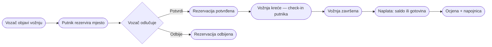

### Uloge i ovlasti

🔗 Uloge se čuvaju kroz ASP.NET Identity (`Admin`, `Driver`, `Passenger`), a domenski tip
korisnika je [`TipKorisnika`](../../src/SideSeat/Models/Enums/TipKorisnika.cs)
(`Vozac`, `Putnik`, `Admin`, `VozacIPutnik`).

| Uloga | Što smije |
|---|---|
| **Putnik** (`Passenger`) | pretraga i rezervacija vožnji, plaćanje, check-in, ocjene, napojnice, vlastiti saldo |
| **Vozač** (`Driver`) | sve kao putnik + KYC verifikacija, objava i vođenje vožnji, potvrda/odbijanje rezervacija, naplata |
| **Admin** | potpuni CRUD nad korisnicima, gradovima, vozilima, plaćanjima + pregled audit zapisa |

### Glavne značajke (popis)

- Registracija/prijava lokalnim računom ili **Google OAuth**.
- Objava, filtriranje i pretraga vožnji s **kartom rute** (OSRM ceste, Leaflet prikaz).
- Rezervacije s životnim ciklusom (potvrda/odbijanje), provjera salda prije rezervacije.
- **Mock plaćanja** (kartica/PayPal/Revolut) — bez stvarne naplate; interni **saldo** i gotovina.
- Ocjene s komentarom, do 5 slika i **napojnicom**.
- **Obavijesti** (zvonce + brojač) i **live vožnja** preko SignalR-a (check-in, lokacija, chat).
- **AI asistent (Copilot)** koji čita podatke i priprema akcije ovisno o ulozi.
- **REST API** + **MCP server** za vanjske klijente.
- Light/dark tema, animirana pozadinska karta, audit log, health endpointi, Docker.

---

## 3. Tehnološki stog

🧠 *Od nule:* „Stog" (engl. *stack*) je popis tehnologija složenih u slojeve — od baze podataka
na dnu do preglednika na vrhu.

| Sloj | Tehnologija | Čemu služi |
|---|---|---|
| Jezik / runtime | **C# / .NET 10** | cijela aplikacija |
| Web framework | **ASP.NET Core MVC** | kontroleri, Razor pogledi, routing |
| ORM | **Entity Framework Core 10** | mapiranje C# klasa ↔ SQL tablice |
| Baza | **SQL Server 2022** (LocalDB lokalno) | trajna pohrana podataka |
| Autentikacija | **ASP.NET Core Identity + Google OAuth** | prijava, uloge, lozinke |
| Realtime | **SignalR** | live vožnja (lokacija, chat) |
| Frontend | **Razor Views, Bootstrap, jQuery, Leaflet** | HTML/CSS/JS, karte |
| Karte/rute | **OSRM** (rute) + **Nominatim** (geokodiranje) | crtanje pravih cesta |
| AI | **Open WebUI / DeepSeek** (preko server proxyja) | Copilot asistent |
| Integracija | **MCP (Model Context Protocol)** | vanjski AI klijenti |
| Testovi | **xUnit + WebApplicationFactory + EF InMemory** | integracijski testovi |
| Deployment | **Docker, Docker Compose, Docker Hub, Caddy** | kontejneri, HTTPS |

---

## 4. Pregled arhitekture (slojevi)

🧠 *Od nule:* Aplikacija je organizirana u **slojeve**. Zahtjev iz preglednika ulazi na vrhu,
spušta se kroz slojeve do baze i vraća odgovor. Svaki sloj ima jednu odgovornost — to olakšava
održavanje i testiranje.

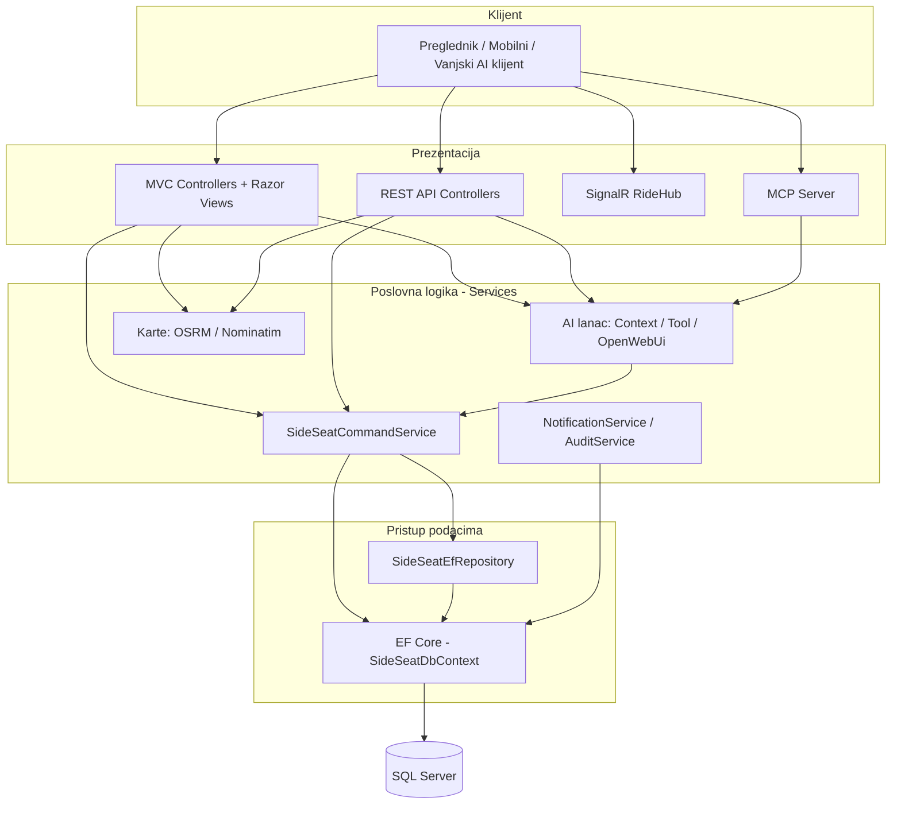

ASCII varijanta (tok odozgo prema dolje):

```
   [ Preglednik ]
        │
        ▼
   [ Controllers / API / Hub / MCP ]   ← prezentacija (HTTP, JSON, WebSocket)
        │
        ▼
   [ Services ]                         ← poslovna pravila, autorizacija, AI, karte
        │
        ▼
   [ Repository / EF Core DbContext ]   ← pristup podacima (LINQ → SQL)
        │
        ▼
   [ SQL Server ]                       ← trajna pohrana
```

🔧 *Tehnički:* Ključno pravilo — **kontroleri su tanki**. Sva write-logika (CRUD, ride
workflow, settlement salda) ide kroz [`SideSeatCommandService`](../../src/SideSeat/Services/SideSeatCommandService.cs),
koji provodi autorizaciju i poslovna pravila na jednom mjestu. I MVC kontroleri i AI/MCP alati
pozivaju **isti** servis — tako se logika ne duplicira.

---

## 5. Stablo repozitorija

📁 Korijen projekta:

```
SideSeat/
├── src/SideSeat/                     # MVC web aplikacija (glavni projekt)
├── tests/SideSeat.IntegrationTests/  # integracijski testovi (xUnit)
├── docs/                             # dokumentacija
│   ├── wiki/                         # wikipedia-style pomoć (i ovaj dokument)
│   └── labs/                         # laboratorijske vježbe + logovi/transkripti
├── changelogs/                       # changelog po verziji (v0.x.md)
├── scripts/                          # pomoćne skripte (docker, sql backup)
├── .github/                          # CI workflowovi, skills, hooks, agenti
├── docker-compose.yml                # lokalni build
├── docker-compose.hub.yml            # pokretanje gotovog Docker Hub imagea
├── docker-compose.prod.yml           # produkcija (SQL + app + Caddy HTTPS)
├── Caddyfile                         # reverse proxy / automatski HTTPS
├── SideSeat.slnx                     # solution
└── README.md
```

📁 Glavni projekt `src/SideSeat/` (po odgovornosti):

```
src/SideSeat/
├── Program.cs              # ulazna točka: DI, pipeline, rute
├── appsettings*.json       # konfiguracija (baza, AI, karte)
├── Dockerfile              # multi-stage build
│
├── Controllers/           # MVC kontroleri (HTML stranice)
│   └── Api/               # REST API kontroleri (JSON)
├── Data/                  # DbContext, seederi, dummy cleaner
├── Models/                # entiteti, enumi, view modeli, DTO-i, komande
│   ├── Entities/          # domenski entiteti (tablice u bazi)
│   ├── Enums/             # statusi i tipovi
│   ├── Forms/             # form view modeli
│   ├── ViewModels/        # zajednički view modeli
│   ├── Ai/                # DTO-i AI chata
│   ├── Api/               # REST DTO-i + ApiMapper
│   └── Commands/          # command recordi za write akcije
├── Services/              # poslovna logika i integracije
├── Repositories/          # EF Core repozitorij (+ povijesni mock)
├── Hubs/                  # SignalR RideHub (live vožnja)
├── Mcp/                   # MCP alati i resursi
├── Middleware/            # MCP API ključ, observability
├── Security/              # custom claims (sideseat:korisnik_id)
├── ViewComponents/        # zvonce obavijesti, chat dock
├── Views/                 # Razor pogledi (.cshtml) po kontroleru + Shared
├── Migrations/            # EF Core migracije baze
└── wwwroot/               # statički sadržaj (css, js, lib, slike)
```

---

## 6. Životni ciklus zahtjeva (request pipeline)

🧠 *Od nule:* „Pipeline" je niz koraka (engl. *middleware*) kroz koje svaki HTTP zahtjev prolazi
**redom** prije nego dođe do kontrolera, pa se odgovor vraća **obrnutim redom**. Svaki korak može
zahtjev propustiti dalje, izmijeniti ili zaustaviti (npr. „nemaš pristup → 403").

🔧 *Tehnički:* Redoslijed je definiran u [`Program.cs`](../../src/SideSeat/Program.cs) (linije ~195–222).

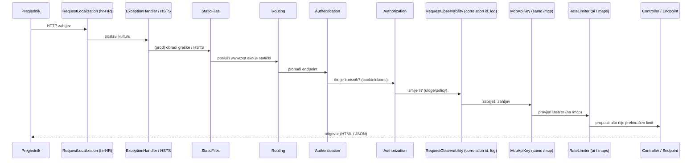

Sažeto, redoslijed middlewarea:

```
RequestLocalization → [prod: ExceptionHandler + HSTS] → [non-Docker: HttpsRedirection]
→ StaticFiles → Routing → Authentication → Authorization
→ RequestObservabilityMiddleware → McpApiKeyMiddleware → RateLimiter
→ StatusCodePages(/Home/HttpStatus) → endpoint
```

---

## 7. Pokretanje aplikacije — `Program.cs`

🧠 *Od nule:* [`Program.cs`](../../src/SideSeat/Program.cs) je **prva datoteka koja se pokrene**.
Radi dvije stvari: (1) **registrira servise** u DI kontejner (faza „builder") i (2) **slaže
pipeline i rute** (faza „app"). DI (*Dependency Injection*) znači da klase ne stvaraju svoje
ovisnosti same — framework im ih „ubaci" kroz konstruktor.

### Što se registrira i zašto

| Registracija | Lifetime | Svrha |
|---|---|---|
| `SideSeatDbContext` (UseSqlServer) | Scoped | pristup bazi; connection string se u Dockeru sastavlja automatski |
| `Identity<AppUser, IdentityRole<int>>` | — | korisnici, uloge, lozinke (min. 8 znakova, bez ostalih pravila) |
| `SideSeatUserClaimsPrincipalFactory` | Scoped | dodaje custom claim `sideseat:korisnik_id` pri prijavi |
| `SideSeatEfRepository` | Scoped | čitanje agregata iz baze |
| `ISideSeatCommandService` | Scoped | **sve write akcije** + autorizacija |
| `IPendingActionService` | Scoped | priprema AI akcija koje čekaju potvrdu |
| `IAiContextService`, `IAiToolService` | Scoped | kontekst i alati za AI |
| `IOpenWebUiService` (HttpClient, 90 s) | Scoped | poziv AI providera + tool-calling petlja |
| `INotificationService`, `IAuditService` | Scoped | obavijesti i audit zapis |
| `IPasswordHashingService` | Scoped | hashiranje lozinki |
| `ICityGeocodingService` (Nominatim) | Singleton | geokodiranje gradova |
| `IRouteGeometryService` (OSRM) | Singleton | geometrija ceste za karte |
| `IPublicWebSearchService` | Singleton | javna web pretraga (Wikipedia/DuckDuckGo) |
| `CheckInReminderService` | HostedService | podsjetnik putniku ~30 min prije polaska |
| `AddSignalR()` + `RideHub` | — | live vožnja |
| `AddMcpServer()` (HTTP transport) | — | MCP alati i resursi iz assemblyja |
| `AddHealthChecks()` + `DatabaseHealthCheck` | — | `/health/live`, `/health/ready` |
| `AddRateLimiter()` | — | politike `ai` (12/min) i `maps` (120/min) |
| `AddProblemDetails` + `GlobalExceptionHandler` | — | jedinstveni format grešaka + correlation id |

🔧 **HttpClient timeoutovi:** `Nominatim` 15 s, `Routing` 2 s, `PublicWebSearch` 10 s, `OpenWebUi` 90 s.

🔧 **Pri startu** (`app` faza): primijeni EF migracije (do 6 pokušaja s retryjem — čeka SQL u
Dockeru), očisti dummy podatke ako `DUMMY_DATA=false`, seedaj Identity uloge i demo korisnike,
te mapiraj rute, health endpointe, `RideHub` na `/hubs/rides` i MCP na `/mcp`.

### Custom rute

Uz default rutu `{controller=Home}/{action=Index}/{id?}` definirane su „lijepe" rute:

| Ruta | Vodi na |
|---|---|
| `/gradovi` | `Grad/Index` |
| `/gradovi/{id}` | `Grad/Details` |
| `/voznje/aktivne` | `Voznja/Active` |
| `/korisnici/{id}/profil` | `Korisnik/Details` |

---

## 8. Podatkovni model (domena)

🧠 *Od nule:* Svaki **entitet** je C# klasa koju EF Core preslika u **tablicu** u bazi. Polja
postaju stupci, a `virtual` reference između klasa postaju **strane ključeve** (veze) između
tablica. Definirani su u 📁 [`Models/Entities/`](../../src/SideSeat/Models/Entities/), a veze i
ograničenja u [`SideSeatDbContext.cs`](../../src/SideSeat/Data/SideSeatDbContext.cs).

### ER dijagram

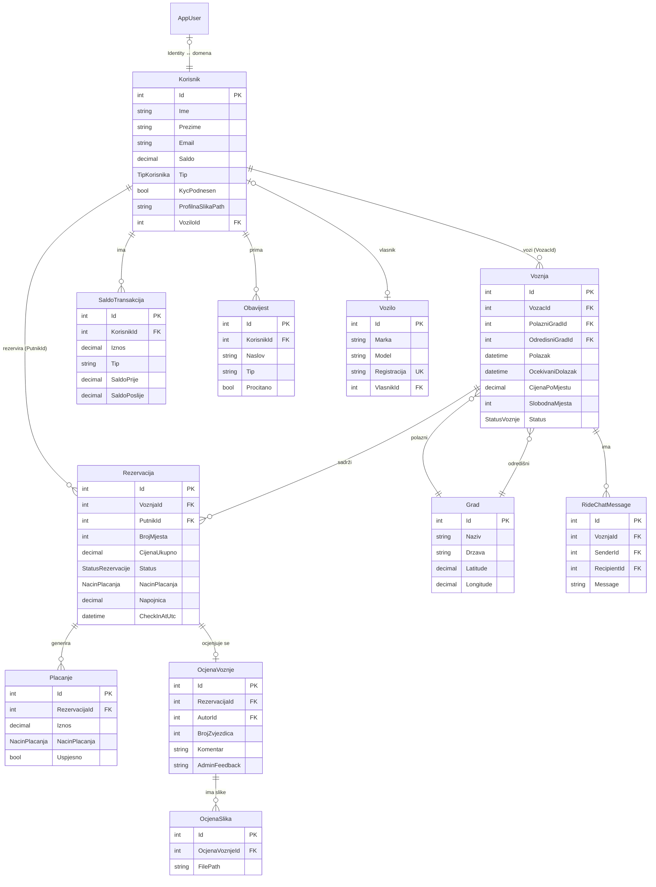

### Entiteti — svrha i ključna polja

| Entitet | Svrha | Ključna polja |
|---|---|---|
| [`Korisnik`](../../src/SideSeat/Models/Entities/Korisnik.cs) | domenski korisnik (vozač/putnik/admin) | `Saldo`, `Tip`, `KycPodnesen`, `ProfilnaSlikaPath`, spremljena kartica/adresa |
| [`AppUser`](../../src/SideSeat/Models/AppUser.cs) | Identity korisnik (prijava) vezan 1:1 na `Korisnik` | `OIB`, `JMBG`, `KorisnikId` |
| [`Grad`](../../src/SideSeat/Models/Entities/Grad.cs) | polazište/odredište s koordinatama | `Naziv`, `Drzava`, `Latitude`, `Longitude` |
| [`Vozilo`](../../src/SideSeat/Models/Entities/Vozilo.cs) | vozačevo vozilo | `Marka`, `Model`, `Registracija` (unique), `BrojSjedala` |
| [`Voznja`](../../src/SideSeat/Models/Entities/Voznja.cs) | objavljena vožnja | `VozacId`, polazni/odredišni grad, `Polazak`, `CijenaPoMjestu`, `SlobodnaMjesta`, `Status` |
| [`Rezervacija`](../../src/SideSeat/Models/Entities/Rezervacija.cs) | putnikova rezervacija mjesta | `BrojMjesta`, `CijenaUkupno`, `Status`, `NacinPlacanja`, `Napojnica`, `CheckInAtUtc`, lokacija |
| [`Placanje`](../../src/SideSeat/Models/Entities/Placanje.cs) | zapis (mock) plaćanja rezervacije | `Iznos`, `NacinPlacanja`, `Uspjesno` |
| [`OcjenaVoznje`](../../src/SideSeat/Models/Entities/OcjenaVoznje.cs) | ocjena nakon vožnje | `BrojZvjezdica`, `Komentar`, `AdminFeedback` |
| [`OcjenaSlika`](../../src/SideSeat/Models/Entities/OcjenaSlika.cs) | slika priložena ocjeni (do 5) | `FilePath`, `ContentType`, `FileSize` |
| [`SaldoTransakcija`](../../src/SideSeat/Models/Entities/SaldoTransakcija.cs) | povijest promjena salda | `Iznos`, `Tip`, `SaldoPrije`, `SaldoPoslije` |
| [`Obavijest`](../../src/SideSeat/Models/Entities/Obavijest.cs) | notifikacija korisniku (zvonce) | `Naslov`, `Poruka`, `Tip`, `Link`, `Procitano` |
| [`RideChatMessage`](../../src/SideSeat/Models/Entities/RideChatMessage.cs) | poruka chata tijekom vožnje | `SenderId`, `RecipientId`, `Message` |
| [`AuditLog`](../../src/SideSeat/Models/AuditLog.cs) | revizijski trag (tko/što/kada) | indeksiran po `CreatedAtUtc` |

### Ponašanje brisanja i ograničenja

🔧 *Tehnički:* `OnDelete` određuje što se dogodi vezanim zapisima kad se obriše roditelj.

| Veza | OnDelete | Posljedica |
|---|---|---|
| Voznja → PolazniGrad / OdredisniGrad | `Restrict` | grad se ne može obrisati ako ga koristi vožnja |
| Rezervacija → Voznja | `Restrict` | vožnja s rezervacijama nije brisiva |
| Placanje / OcjenaVoznje → Rezervacija | `Restrict` | rezervacija s plaćanjem/ocjenom nije brisiva |
| Vozilo → Vlasnik, Korisnik → Vozilo | `SetNull` | brisanjem vlasnika veza postaje NULL |
| SaldoTransakcija / Obavijest → Korisnik | `Cascade` | brisanjem korisnika brišu se i njegove transakcije/obavijesti |
| RideChatMessage → Voznja | `Cascade` | poruke se brišu s vožnjom |
| OcjenaSlika → OcjenaVoznje | `Cascade` | slike se brišu s ocjenom |

**Unique indeksi:** `Grad{Naziv, Drzava}`, `Vozilo.Registracija`, `AppUser.KorisnikId`
(filtrirano na NOT NULL). **Decimal preciznost** `18,2` za novčane iznose; koordinate `9,6`.

### Enumeracije (stanja)

🔗 [`Models/Enums/`](../../src/SideSeat/Models/Enums/)

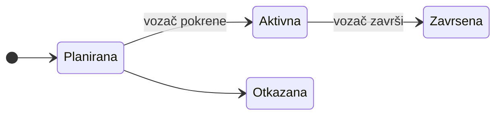

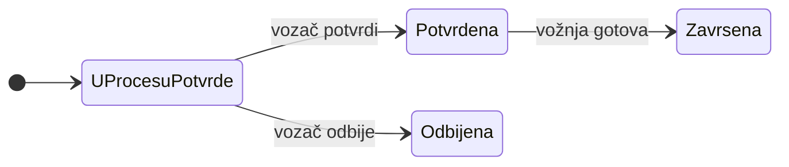

| Enum | Vrijednosti |
|---|---|
| [`StatusVoznje`](../../src/SideSeat/Models/Enums/StatusVoznje.cs) | `Planirana`, `Aktivna`, `Zavrsena`, `Otkazana` |
| [`StatusRezervacije`](../../src/SideSeat/Models/Enums/StatusRezervacije.cs) | `UProcesuPotvrde`, `Potvrdena`, `Odbijena`, `Zavrsena` |
| [`TipKorisnika`](../../src/SideSeat/Models/Enums/TipKorisnika.cs) | `Vozac`, `Putnik`, `Admin`, `VozacIPutnik` |
| [`NacinPlacanja`](../../src/SideSeat/Models/Enums/NacinPlacanja.cs) | `PayPal`, `Kartica`, `RevolutPay`, `SideSeatSaldo`, `Gotovina` |

---

## 9. Sloj po sloj — svaki folder detaljno

### 9.1 📁 `Controllers/` — MVC kontroleri (HTML)

🧠 *Od nule:* Kontroler prima HTTP zahtjev, pozove servis, i vrati **Razor pogled** (HTML stranicu)
ili redirect. U MVC-u: **M**odel (podaci), **V**iew (prikaz), **C**ontroller (koordinator).

| Kontroler | Odgovornost | Ključne akcije |
|---|---|---|
| [`HomeController`](../../src/SideSeat/Controllers/HomeController.cs) | početni dashboard, pretraga, vodič | `Index`, `Vodic`, `Privacy`, `HttpStatus` |
| [`AuthController`](../../src/SideSeat/Controllers/AuthController.cs) | prijava, registracija, odjava, Google | `Login`, `Register`, `Logout`, external login |
| [`KorisnikController`](../../src/SideSeat/Controllers/KorisnikController.cs) | profil, postavke, KYC, **saldo** | `Details`, `Settings`, `Kyc`, `Saldo`, `Uplata` |
| [`VoznjaController`](../../src/SideSeat/Controllers/VoznjaController.cs) | vožnje + life cycle | `Index`, `Create`, `Active`, `Current`, `Finish` |
| [`RezervacijaController`](../../src/SideSeat/Controllers/RezervacijaController.cs) | rezervacije + potvrda/plaćanje | `Create`, `Details`, `Index`, admin CRUD |
| [`OcjenaController`](../../src/SideSeat/Controllers/OcjenaController.cs) | ocjene + **napojnica** + slike | `Create`, `Edit`, `Attachments`, `AdminFeedback` |
| [`GradController`](../../src/SideSeat/Controllers/GradController.cs) | CRUD gradova (admin) | `Index`/`Create`/`Edit`/`Delete` |
| [`VoziloController`](../../src/SideSeat/Controllers/VoziloController.cs) | CRUD vozila (admin) | isto |
| [`PlacanjeController`](../../src/SideSeat/Controllers/PlacanjeController.cs) | CRUD plaćanja (admin) | isto |
| [`ObavijestController`](../../src/SideSeat/Controllers/ObavijestController.cs) | obavijesti korisnika | popis, označi pročitano |
| [`AuditController`](../../src/SideSeat/Controllers/AuditController.cs) | pregled audit zapisa (admin) | `Index` |
| [`ConfirmationController`](../../src/SideSeat/Controllers/ConfirmationController.cs) | stranice potvrde | `Reservation`, `Ride` |
| [`AiController`](../../src/SideSeat/Controllers/AiController.cs) | backend AI chat widgeta | prima poruke → odgovor + pending akcija |
| [`AiActionController`](../../src/SideSeat/Controllers/AiActionController.cs) | pregled/potvrda AI akcija | `Review` |

### 9.2 📁 `Controllers/Api/` — REST API (JSON)

🧠 *Od nule:* API kontroleri vraćaju **JSON** umjesto HTML-a, za vanjske klijente, MCP i
JavaScript dijelove. Ne izlažu EF entitete direktno — koriste **DTO** (Data Transfer Object).

| Kontroler | Ruta | Operacije |
|---|---|---|
| `GradoviApiController` | `/api/gradovi` | CRUD + `?q=` |
| `KorisniciApiController` | `/api/korisnici` | CRUD + `?q=` |
| `VozilaApiController` | `/api/vozila` | CRUD + `?q=` |
| `VoznjeApiController` | `/api/voznje` | CRUD + `?q=`, `?date=` |
| `RezervacijeApiController` | `/api/rezervacije` | CRUD + `?q=` |
| `PlacanjaApiController` | `/api/placanja` | CRUD + `?date=` |
| `OcjeneApiController` | `/api/ocjene` | CRUD + `?q=` |
| `SaldoTransakcijeApiController` | `/api/saldo-transakcije` | CRUD + `?q=` |
| `MapsApiController` | `/api/maps/route` | geometrija rute (OSRM) za karte |
| `SearchApiController` | `/api/search` | globalna pretraga (Ctrl+K) |
| `RideChatApiController` | — | poruke chata vožnje |

🔧 Mapiranje entitet ↔ DTO radi [`ApiMapper`](../../src/SideSeat/Models/Api/ApiMapper.cs);
DTO-i su u [`SideSeatApiDtos.cs`](../../src/SideSeat/Models/Api/SideSeatApiDtos.cs).

### 9.3 📁 `Data/` — pristup podacima

| Datoteka | Uloga |
|---|---|
| [`SideSeatDbContext`](../../src/SideSeat/Data/SideSeatDbContext.cs) | EF Core DbContext: 12 DbSetova + Identity, veze, indeksi, preciznosti |
| [`IdentityDataSeeder`](../../src/SideSeat/Data/IdentityDataSeeder.cs) | seed uloga (`Admin`/`Driver`/`Passenger`) i demo korisnika |
| [`DummyDataCleaner`](../../src/SideSeat/Data/DummyDataCleaner.cs) | uklanjanje demo podataka kad `DUMMY_DATA=false` |

### 9.4 📁 `Models/` — modeli

🧠 *Od nule:* Ne miješaj tipove modela — svaki ima svoju svrhu:

| Vrsta | Folder | Što je |
|---|---|---|
| **Entitet** | `Entities/` | preslika tablice u bazi (perzistira se) |
| **Enum** | `Enums/` | nabrojiva stanja/tipovi |
| **View model** | `Forms/`, `ViewModels/`, `Korisnik/`, `Ocjena/`, `Voznja/`, `Home/`, `Auth/`, `Notifications/` | oblikovan za **jedan pogled** (forma/lista/detalji) |
| **DTO** | `Api/` | oblik podataka za REST API (+`ApiMapper`) |
| **AI DTO** | `Ai/` | `AiChatMessage`/`Request`/`Response` |
| **Command** | `Commands/` | `CreateRideCommand` itd. + `PendingActionDescriptor`/`Envelope`, `CommandResult` |
| **Demo** | `Demo/` | povijesni Lab 1 in-memory podaci |

🔧 Razdvajanje entiteta od view modela/DTO-a je namjerno: pogledi i API nikad ne vide EF entitete
ni Identity podatke direktno (sigurnost + stabilnost API ugovora).

### 9.5 📁 `Services/` — poslovna logika

🧠 *Od nule:* Servisi sadrže **pravila** (npr. „smije li ovaj korisnik završiti vožnju?", „ima
li dovoljno salda?"). Kontroleri ih samo pozivaju. Svaki servis ima sučelje (`I...`) i implementaciju
— to omogućuje testiranje s lažnim (mock) implementacijama.

| Sučelje → implementacija | Lifetime | Odgovornost |
|---|---|---|
| `ISideSeatCommandService` → [`SideSeatCommandService`](../../src/SideSeat/Services/SideSeatCommandService.cs) | Scoped | **sve write akcije**, ride workflow, settlement, autorizacija |
| `IPendingActionService` → `PendingActionService` | Scoped | priprema i pohrana AI akcija koje čekaju potvrdu |
| `IAiToolService` → `AiToolService` | Scoped | definicije AI alata + **role-bazirano** serviranje |
| `IAiContextService` → `AiContextService` | Scoped | gradi poslovni kontekst i sitemap za AI |
| `IOpenWebUiService` → `OpenWebUiService` | Scoped | poziv AI providera (OpenWebUI/DeepSeek) + tool-calling petlja |
| `IPublicWebSearchService` → `PublicWebSearchService` | Singleton | web pretraga (Wikipedia + DuckDuckGo), cache, timeout |
| `IRouteGeometryService` → `OsrmRouteGeometryService` | Singleton | geometrija ceste (OSRM) + cache 7 dana |
| `ICityGeocodingService` → `NominatimCityGeocodingService` | Singleton | geokodiranje gradova (Nominatim) |
| `INotificationService` → `NotificationService` | Scoped | kreiranje obavijesti |
| `IAuditService` → `AuditService` | Scoped | pisanje audit zapisa |
| `IPasswordHashingService` → `PasswordHashingService` | Scoped | hashiranje/verifikacija lozinki |
| — `CheckInReminderService` | HostedService | podsjetnik za check-in ~30 min prije |
| — `DatabaseHealthCheck`, `GlobalExceptionHandler` | — | health i centralne greške |

🔧 **AI lanac (kako Copilot radi):**

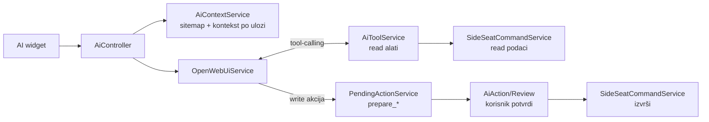

### 9.6 Ostali folderi

| Folder | Sadržaj / uloga |
|---|---|
| 📁 [`Hubs/`](../../src/SideSeat/Hubs/RideHub.cs) | **SignalR** `RideHub` — live vožnja (lokacije, chat, status u realnom vremenu), mapiran na `/hubs/rides` |
| 📁 [`Mcp/`](../../src/SideSeat/Mcp/) | **MCP server**: `SideSeatMcpTools` (akcije) i `SideSeatMcpResources` (resursi `sideseat://sitemap`, `sideseat://api-summary`) |
| 📁 [`Middleware/`](../../src/SideSeat/Middleware/) | `McpApiKeyMiddleware` (Bearer ključ za `/mcp`), `RequestObservabilityMiddleware` (correlation id, JSON log) |
| 📁 [`Security/`](../../src/SideSeat/Security/) | `SideSeatClaimTypes` (`sideseat:korisnik_id`), `ClaimsPrincipalExtensions` (`GetKorisnikId()`), `SideSeatUserClaimsPrincipalFactory` |
| 📁 [`Repositories/`](../../src/SideSeat/Repositories/) | `SideSeatEfRepository` (čitanje agregata), `LabMockRepository` (povijesni in-memory) |
| 📁 [`ViewComponents/`](../../src/SideSeat/ViewComponents/) | `ObavijestiBellViewComponent` (zvonce), `RideChatDockViewComponent` (plutajući chat) |
| 📁 [`Migrations/`](../../src/SideSeat/Migrations/) | EF Core migracije (shema baze kroz vrijeme); primjenjuju se **automatski na startu** |
| 📁 [`Properties/`](../../src/SideSeat/Properties/launchSettings.json) | `launchSettings.json` — profili lokalnog pokretanja (`https` itd.) |

### 9.7 📁 `Views/` — Razor pogledi

🧠 *Od nule:* `.cshtml` su HTML predlošci s ugrađenim C#-om (`@Model.Ime`). Po jedan folder za
svaki kontroler; zajedničke dijelove drži `Shared/`.

| Pogled / partial | Uloga |
|---|---|
| `Shared/_Layout.cshtml` | glavni okvir stranice (navbar, footer, teme) |
| `Shared/_AiAssistant.cshtml` | AI Copilot widget |
| `Shared/_RouteMap.cshtml` / `_RouteMapBackground.cshtml` | karta rute / animirana pozadinska karta |
| `Shared/_OcjenaSlike.cshtml`, `_AutocompleteLookup.cshtml`, `_DateTimeInput.cshtml` | reusable partiali |
| `Shared/Components/ObavijestiBell`, `RideChatDock` | pogledi view komponenti |
| `_ViewImports.cshtml`, `_ViewStart.cshtml` | globalni using-i i layout postavka |

### 9.8 📁 `wwwroot/` — statički sadržaj

| Putanja | Sadržaj |
|---|---|
| `css/site.css`, `performative.css`, `route-maps.css` | glavni stil, vizualni efekti, stil karata |
| `js/site.js`, `route-maps.js`, `route-background.js` | UI logika, interaktivne karte, animacija auta po pravim rutama |
| `lib/` | vendor biblioteke: Bootstrap, jQuery, jQuery-validation, **Leaflet** |
| `images/`, `favicon.*` | slike i ikone |
| `uploads/` (runtime) | slike ocjena (`uploads/ocjene/{id}`) i profila (`uploads/profili/{id}`) |

---

## 10. Ključni tokovi (end-to-end)

### 10.1 Registracija i prijava

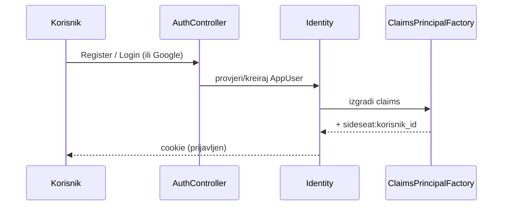

### 10.2 Životni ciklus vožnje (glavni tok)

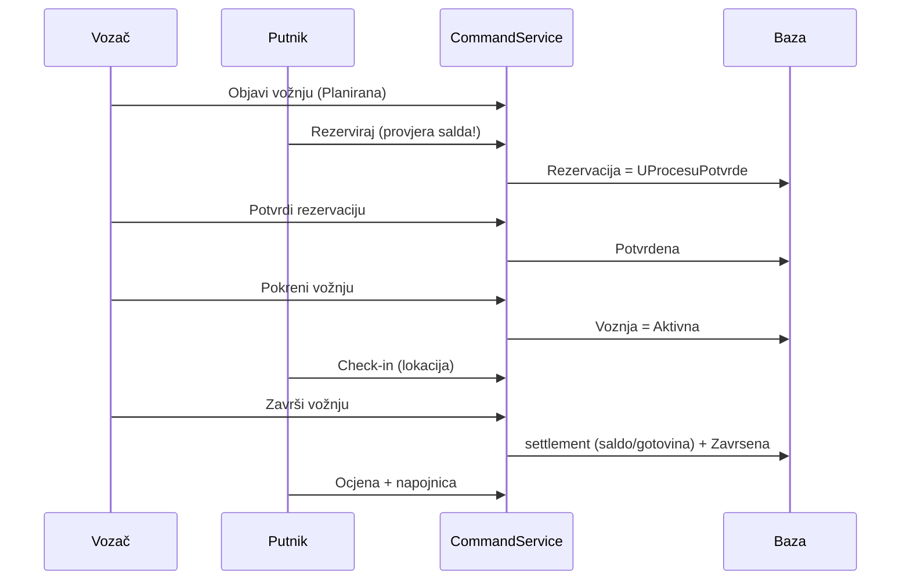

### 10.3 Provjera salda i mock checkout

🧠 Pri rezervaciji se provjerava pokriva li **raspoloživi** saldo novu rezervaciju **plus sve već
zakazane**. Ako ne, crveni toast s iznosom koji nedostaje i linkom na uplatu. Checkout je
demonstracijski: kartica `4444 4444 4444 4444`, ili PayPal/Revolut modal. Puni broj kartice i CVV
se **ne spremaju**; čuva se samo maskirani izvor (`*4444`).

### 10.4 AI „prepare → confirm → execute"

🧠 AI nikad ne mijenja podatke odmah. Write akcija se prvo **pripremi** (`prepare_*`), korisnik je
**pregleda i potvrdi** na `AiAction/Review`, pa se tek onda **izvrši** kroz `SideSeatCommandService`.
Read alati (`get_current_user`, `get_rides`, `get_reservations`, `get_balance`) su role-aware.

### 10.5 Live vožnja (SignalR)

🧠 Tijekom aktivne vožnje putnik i vozač su spojeni na `RideHub` (`/hubs/rides`). Putnik radi
**check-in** i šalje lokaciju; vozač vidi lokaciju na karti i ima navigaciju (Google Maps/Waze);
chat ide u realnom vremenu (i sprema se kao `RideChatMessage`).

---

## 11. Autentikacija i autorizacija

🧠 *Od nule:* **Autentikacija** = „tko si ti?" (prijava). **Autorizacija** = „smiješ li ovo?"
(uloge/pravila).

🔧 *Tehnički:*
- **Identity** s `IdentityRole<int>`; lozinka min. 8 znakova (ostala pravila isključena),
  jedinstveni email obavezan, potvrda računa nije potrebna.
- **Google OAuth** se registrira **samo ako** su `ClientId` i `ClientSecret` postavljeni.
- Pri prijavi [`SideSeatUserClaimsPrincipalFactory`](../../src/SideSeat/Security/SideSeatUserClaimsPrincipalFactory.cs)
  dodaje claim `sideseat:korisnik_id`, koji se čita kroz `ClaimsPrincipalExtensions.GetKorisnikId()`.
- **Cookie redirect pravila** razlikuju API i web:

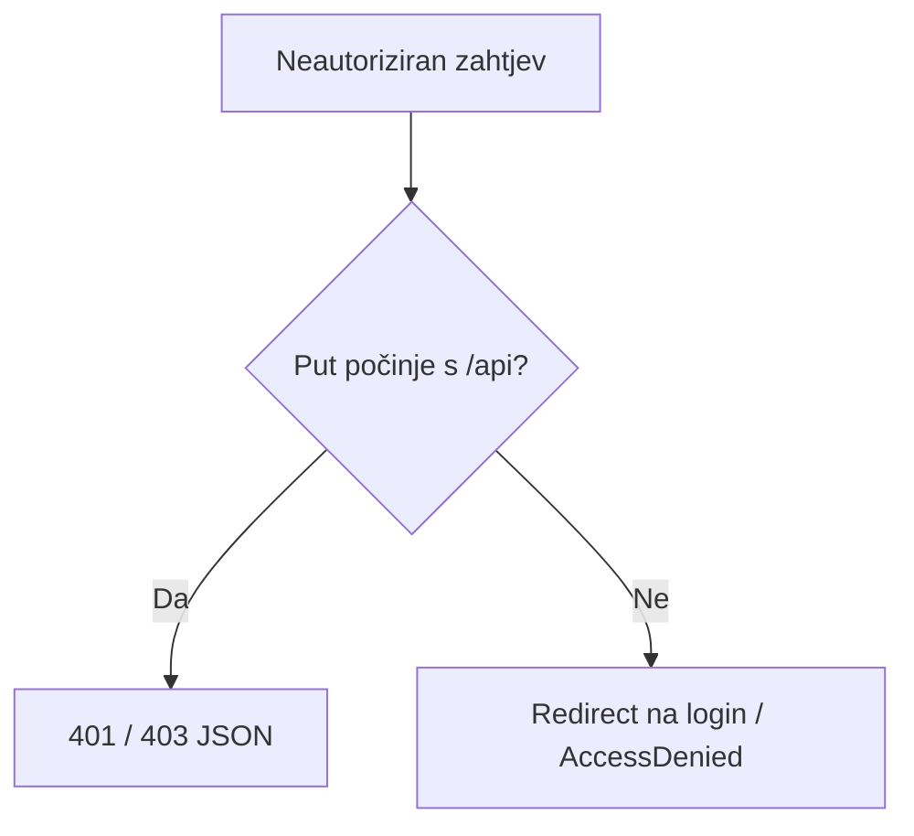

---

## 12. REST API referenca

| Resurs | Ruta | Pretraga |
|---|---|---|
| Gradovi | `/api/gradovi` | `?q=` |
| Korisnici | `/api/korisnici` | `?q=` |
| Vozila | `/api/vozila` | `?q=` |
| Vožnje | `/api/voznje` | `?q=`, `?date=` |
| Rezervacije | `/api/rezervacije` | `?q=` |
| Plaćanja | `/api/placanja` | `?date=` |
| Ocjene | `/api/ocjene` | `?q=` |
| Saldo transakcije | `/api/saldo-transakcije` | `?q=` |

Svaki resurs podržava `GET all`, `GET by id`, `POST`, `PUT`, `DELETE` gdje poslovna pravila
dopuštaju. Mutation endpointi zaštićeni su rolama. **MCP** je dostupan na `/mcp` uz
`Authorization: Bearer <MCP_API_KEY>`. Detaljnije: [REST-API.md](REST-API.md).

---

## 13. Konfiguracija i okruženja

🧠 *Od nule:* Postavke (lozinke, ključevi, URL-ovi) ne pišu se u kod — drže se u konfiguraciji
koja se razlikuje po okruženju (lokalno / Docker / produkcija).

| Izvor | Kad se koristi |
|---|---|
| `appsettings.json` | zajedničke postavke |
| `appsettings.Development.json` | lokalni razvoj |
| `appsettings.Docker.json` | Docker okruženje |
| `.env` (iz `.env.example`) | Docker Compose varijable |
| **user-secrets** | tajne lokalno (Google, AI ključ) — nikad u Git |

Najvažnije varijable:

| Varijabla | Značenje |
|---|---|
| `SA_PASSWORD` | lozinka SQL Servera u Dockeru |
| `GOOGLE_CLIENT_ID` / `_SECRET` | Google OAuth |
| `DUMMY_DATA` | uključi/isključi demo podatke (`false` zadano) |
| `AI_API_TYPE` / `AI_BASE_URL` / `AI_API_KEY` / `AI_MODEL` | AI provider (OpenWebUi/DeepSeek) |
| `MCP_API_KEY` / `MCP_USER_ID` | MCP autentikacija i servisni korisnik |
| `MAPS_ROUTING_BASE_URL` / `_TIMEOUT_MILLISECONDS` | OSRM routing |

Detaljnije: [Configuration.md](Configuration.md) i [Deployment.md](Deployment.md).

---

## 14. Testovi

🧠 *Od nule:* **Integracijski testovi** pokreću cijelu aplikaciju u memoriji
(`WebApplicationFactory`) i šalju prave HTTP zahtjeve — provjeravaju da slojevi rade **zajedno**.

🔧 Pokretanje:

```bash
dotnet test tests/SideSeat.IntegrationTests/SideSeat.IntegrationTests.csproj
```

Pokrivenost (prema 📁 `tests/SideSeat.IntegrationTests`):

| Test grupa | Što provjerava |
|---|---|
| `MvcCrudTests` / `ApiCrudTests` | CRUD, validacija, `404`, autorizacija (MVC i REST) |
| `AiToolServiceTests` | AI alati, role-bazirani pristup, lookup gradova |
| `AiContextTests` | poslovni kontekst za AI |
| `OpenWebUiServiceTests` | tool-calling petlja prema provideru (fake HTTP) |
| `RideWorkflowFeatureTests` | životni ciklus vožnje + settlement |
| `CityGeocodingServiceTests` / `RouteGeometryServiceTests` | karte i rute |
| `NavigationTests` / `SeminarFeatureTests` / `SqlServerConstraintTests` | navigacija, značajke, DB ograničenja |
| `TestAuthHandler` | test autentikacija (uloge preko zaglavlja) |

CI (GitHub Actions, [`.github/workflows/dotnet-ci.yml`](../../.github/workflows/dotnet-ci.yml))
pokreće Release build + sve testove na svaki push/PR prema `main`.

---

## 15. Pojmovnik (glosar)

| Pojam | Objašnjenje |
|---|---|
| **MVC** | Model-View-Controller — obrazac razdvajanja podataka, prikaza i logike |
| **DI** | Dependency Injection — framework „ubacuje" ovisnosti u konstruktor |
| **Scoped / Singleton / Hosted** | lifetime servisa: po zahtjevu / jedan za cijelu app / pozadinski zadatak |
| **EF Core** | ORM koji mapira C# klase na SQL tablice |
| **Migracija** | verzionirana promjena sheme baze |
| **DTO** | Data Transfer Object — oblik podataka za prijenos (API), odvojen od entiteta |
| **Entitet** | klasa preslikana u tablicu baze |
| **View model** | model oblikovan za jedan konkretan pogled |
| **Claim** | tvrdnja o korisniku u cookieju (npr. `sideseat:korisnik_id`) |
| **Middleware** | korak u HTTP pipelineu |
| **SignalR** | realtime komunikacija (WebSocket) server↔klijent |
| **MCP** | Model Context Protocol — standard za alate/resurse vanjskim AI klijentima |
| **OSRM** | servis koji vraća geometriju ceste između točaka |
| **Nominatim** | geokodiranje (naziv mjesta → koordinate) |
| **Rate limiter** | ograničenje broja zahtjeva u vremenskom prozoru |
| **KYC** | Know Your Customer — verifikacija identiteta vozača |
| **Settlement** | konačni obračun (naplata salda/gotovine) na kraju vožnje |

---

## 16. Mapa za daljnje učenje

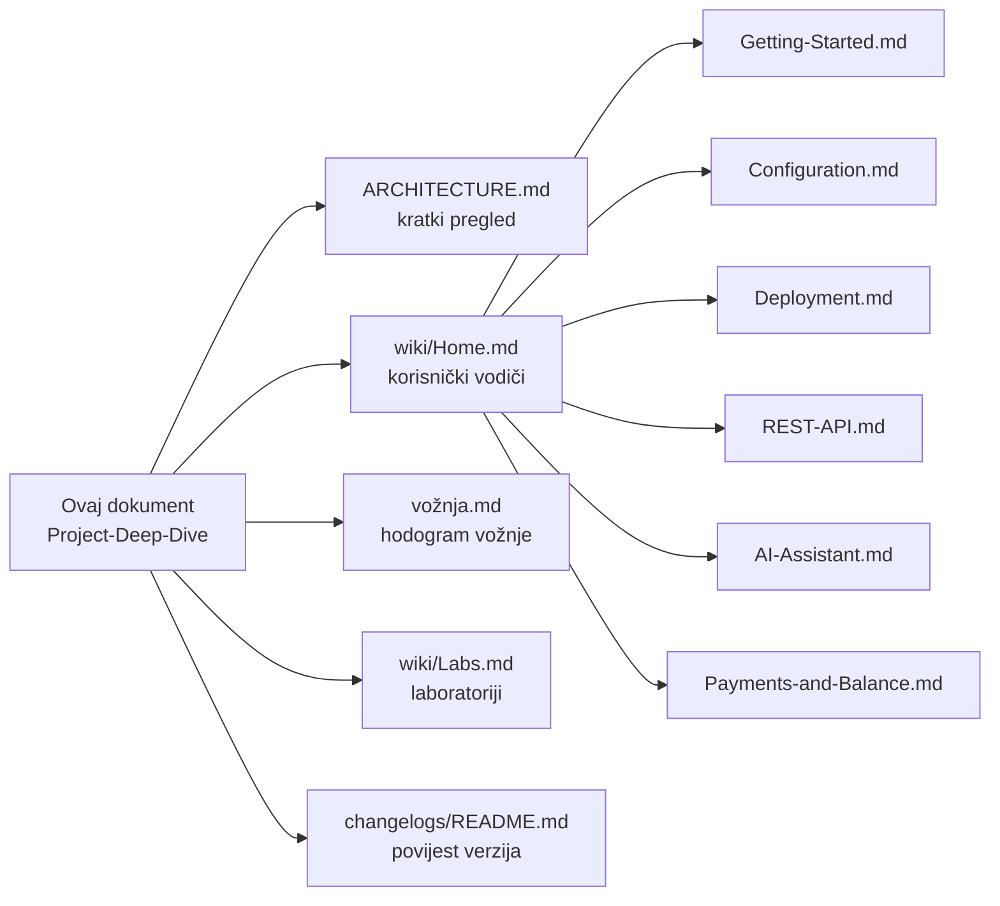

- [ARCHITECTURE.md](../ARCHITECTURE.md) — sažeti pregled svakog foldera i klase
- [wiki/Home.md](Home.md) — vodiči po ulozi i značajke
- [Getting-Started.md](Getting-Started.md) · [Configuration.md](Configuration.md) · [Deployment.md](Deployment.md)
- [REST-API.md](REST-API.md) · [AI-Assistant.md](AI-Assistant.md) · [Payments-and-Balance.md](Payments-and-Balance.md)
- [vožnja.md](../vožnja.md) — korak-po-korak tijek vožnje
- [wiki/Labs.md](Labs.md) — laboratorijske vježbe · [changelogs/README.md](../../changelogs/README.md) — povijest izdanja
