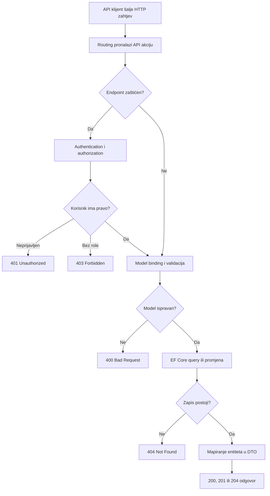
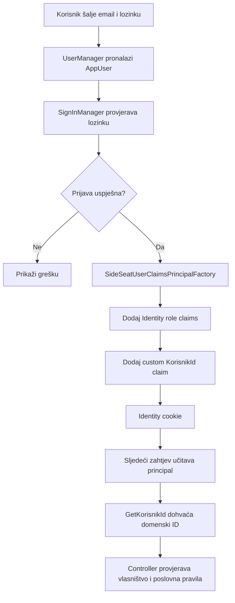
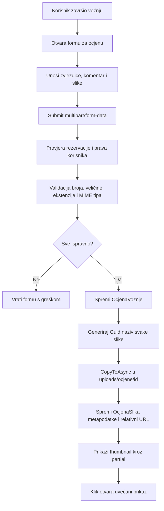
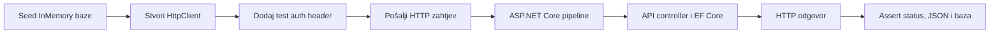

# Vodič za Lab 5 - REST API, Identity, upload i integracijski testovi

Ovaj dokument služi kao priprema za usmeno i kao sažetak implementacije svega što je traženo u **Lab 5** za projekt **SideSeat**.

Projekt nema entitet `Quiz` iz primjera zadatka. Zahtjevi su zato prilagođeni domeni dijeljenja prijevoza:

- potpuni REST API napravljen je za glavne SideSeat entitete
- upload datoteka vezan je uz `OcjenaVoznje`
- slike predstavljaju fotografije povezane s recenzijom završene vožnje

Predaja je **12. lipnja 2026.**

---

## 1. REST API podrška za sve glavne entitete

Lab 5 zahtijeva API controllere koji podržavaju dohvat, pretragu, kreiranje, izmjenu i brisanje podataka gdje poslovna pravila to dopuštaju.

### Implementirani API resursi

| Entitet | Ruta | Pretraga |
| --- | --- | --- |
| Grad | `/api/gradovi` | `?q=` |
| Korisnik | `/api/korisnici` | `?q=` |
| Vozilo | `/api/vozila` | `?q=` |
| Vožnja | `/api/voznje` | `?q=`, `?date=` |
| Rezervacija | `/api/rezervacije` | `?q=` |
| Plaćanje | `/api/placanja` | `?date=` |
| Ocjena vožnje | `/api/ocjene` | `?q=` |
| Saldo transakcija | `/api/saldo-transakcije` | `?q=` |

### Podržane operacije

- `GET /api/resurs` dohvaća kolekciju zapisa.
- `GET /api/resurs/{id}` dohvaća jedan zapis.
- `POST /api/resurs` kreira novi zapis.
- `PUT /api/resurs/{id}` mijenja postojeći zapis.
- `DELETE /api/resurs/{id}` briše zapis.

API vraća odgovarajuće HTTP statuse:

- `200 OK` za uspješan dohvat ili izmjenu
- `201 Created` za uspješno kreiranje
- `204 No Content` za uspješno brisanje
- `400 Bad Request` za neispravan model
- `401 Unauthorized` za neprijavljenog korisnika
- `403 Forbidden` za korisnika bez dopuštenja
- `404 Not Found` kada zapis ne postoji

### Tehnički naglasci

- API controlleri koriste `[ApiController]` i attribute routing.
- Queryji koriste `AsNoTracking()` kada se podaci samo čitaju.
- Povezani podaci učitavaju se pomoću `Include` i `ThenInclude`.
- Kod izmjene se dohvaća postojeći entitet i mapiraju samo dopuštena polja.
- API ne vraća EF entitete ni Identity zapise izravno.

Reference:

- [API controlleri](src/SideSeat/Controllers/Api)
- [DTO i request modeli](src/SideSeat/Models/Api/SideSeatApiDtos.cs)
- [API mapper](src/SideSeat/Models/Api/ApiMapper.cs)

---

## 2. DTO i request modeli

DTO modeli određuju podatke koje API smije vratiti klijentu. Request modeli određuju podatke koje klijent smije poslati pri kreiranju ili izmjeni.

### Zašto se ne vraćaju EF entiteti

- Entiteti mogu sadržavati interna ili osjetljiva polja.
- Navigacijska svojstva mogu stvoriti ciklički ili prevelik JSON.
- API ugovor ne treba ovisiti o strukturi baze.
- Klijent treba dobiti samo podatke koji su mu potrebni.

### Implementacijski obrazac

Datoteka `SideSeatApiDtos.cs` sadrži:

- DTO modele za odgovor
- request modele za `POST` i `PUT`
- validacijske anotacije za obavezna polja, duljine i raspone
- ugniježđene sažete modele povezanih entiteta

`ApiMapper.cs` sadrži extension metode koje pretvaraju entitete u DTO modele. Time se mapiranje ne duplicira u svakoj akciji controllera.

### Zaštita korisničkih podataka

- Lista svih korisnika dostupna je samo administratoru.
- Detaljne podatke korisnika može vidjeti administrator ili vlasnik profila.
- Drugim korisnicima MVC prikaz pokazuje samo dopuštene javne podatke.
- Lozinke, password hash, security stamp i ostali Identity podaci nisu dio API DTO modela.

---

## 3. ASP.NET Core Identity i lokalna autentikacija

Prethodni custom cookie login zamijenjen je ASP.NET Core Identity sustavom.

### Identity model

`SideSeatDbContext` nasljeđuje:

```csharp
IdentityDbContext<AppUser, IdentityRole<int>, int>
```

`AppUser` nasljeđuje `IdentityUser<int>` i dodaje:

- `OIB`
- `JMBG`
- `KorisnikId`

`KorisnikId` povezuje Identity račun s postojećim domenskim zapisom `Korisnik`.

### Registracija

Registracija:

1. validira email, lozinku, OIB, JMBG, adresu i mobitel
2. provjerava postoji li već račun s istim emailom
3. stvara domenski zapis `Korisnik`
4. stvara povezani `AppUser`
5. dodjeljuje rolu `Passenger`
6. prijavljuje novog korisnika

### Prijava

Prijava koristi:

- `UserManager<AppUser>` za dohvat korisnika
- `SignInManager<AppUser>` za provjeru lozinke i prijavu
- Identity application cookie za održavanje sesije

Opcija `Zapamti me` prosljeđuje se u `PasswordSignInAsync` kao `isPersistent`, pa prijava može ostati aktivna nakon zatvaranja preglednika.

### Logout

Logout koristi `SignInManager.SignOutAsync()` i zaštićen je antiforgery tokenom.

Reference:

- [AppUser.cs](src/SideSeat/Models/AppUser.cs)
- [SideSeatDbContext.cs](src/SideSeat/Data/SideSeatDbContext.cs)
- [AuthController.cs](src/SideSeat/Controllers/AuthController.cs)
- [Program.cs](src/SideSeat/Program.cs)

---

## 4. Role, claims i autorizacija

Implementirane su tri Identity role:

- `Admin`
- `Driver`
- `Passenger`

### Prava po ulozi

| Područje | Anonimni | Passenger | Driver | Admin |
| --- | --- | --- | --- | --- |
| Javni API podaci | da | da | da | da |
| Vlastiti profil | ne | da | da | da |
| Sve korisničke podatke | ne | ne | ne | da |
| Kreiranje i upravljanje vlastitim vožnjama | ne | ne | da | da |
| Vlastite rezervacije | ne | da | da | da |
| Rezervacije vlastitih vožnji | ne | ne | da | da |
| Administrativni API CRUD | ne | ne | ne | da |

### Seed rola

`IdentityDataSeeder`:

- stvara role ako ne postoje
- povezuje postojeće domenske korisnike s Identity računima
- mapira `TipKorisnika` u odgovarajuću Identity rolu
- dodjeljuje demo lozinke samo seedanim razvojnim korisnicima

### Custom claim

Identity ID i domenski `Korisnik.Id` nisu ista stvar. Zato se u principal dodaje poseban claim:

```text
KorisnikId
```

`SideSeatUserClaimsPrincipalFactory` stvara claim, a `ClaimsPrincipalExtensions.GetKorisnikId()` omogućuje controllerima siguran dohvat domenskog ID-a.

### API ponašanje

Cookie autentikacija za MVC inače radi redirect na login. Za API rute konfigurirano je:

- `401` umjesto HTML redirecta kada korisnik nije prijavljen
- `403` umjesto redirecta kada nema potrebnu rolu

To je važno jer API klijent očekuje status kod, a ne HTML login stranicu.

Reference:

- [IdentityDataSeeder.cs](src/SideSeat/Data/IdentityDataSeeder.cs)
- [SideSeatUserClaimsPrincipalFactory.cs](src/SideSeat/Security/SideSeatUserClaimsPrincipalFactory.cs)
- [ClaimsPrincipalExtensions.cs](src/SideSeat/Security/ClaimsPrincipalExtensions.cs)

---

## 5. Google autentikacija

Google OAuth koristi ASP.NET Core Google authentication provider.

### Tok Google prijave

1. korisnik klikne Google gumb na prijavi ili registraciji
2. aplikacija preusmjerava korisnika na Google
3. Google vraća potvrđeni vanjski identitet
4. postojeći Identity račun se prijavljuje ili povezuje s Google računom
5. novi korisnik dovršava SideSeat profil

Pri prvoj Google prijavi korisnik mora unijeti:

- OIB
- JMBG
- adresu
- broj mobitela

### Opcionalna konfiguracija

Google provider registrira se samo kada postoje i Client ID i Client Secret. Bez tajni:

- aplikacija se normalno pokreće
- lokalna registracija i prijava rade
- Google gumb se ne prikazuje

Time razvojno pokretanje u Visual Studiju i Dockeru ne pada zbog praznog `ClientId`.

### User secrets

Iz root direktorija repozitorija:

```powershell
dotnet user-secrets set "Authentication:Google:ClientId" "CLIENT_ID" --project src/SideSeat
dotnet user-secrets set "Authentication:Google:ClientSecret" "CLIENT_SECRET" --project src/SideSeat
```

Redirect URI za lokalni HTTPS profil:

```text
https://localhost:7119/signin-google
```

Redirect URI za Docker:

```text
http://localhost:8080/signin-google
```

Google tajne nisu spremljene u repozitoriju.

---

## 6. Upload slika recenzije

Zadatak koristi upload privitaka uz kviz. SideSeat nema kvizove pa su slike vezane uz `OcjenaVoznje`, odnosno uz recenziju konkretne završene vožnje.

### Model metapodataka

`OcjenaSlika` sprema:

- `OcjenaVoznjeId`
- originalni naziv datoteke
- relativnu web-putanju
- MIME tip
- veličinu
- vrijeme stvaranja

### Fizičko spremanje

Datoteke se spremaju na server:

```text
wwwroot/uploads/ocjene/{ocjenaId}
```

U bazu se sprema relativna putanja:

```text
/uploads/ocjene/12/7e4621d9f7684cc58f7d918d5ea3e024.png
```

Za spremljeni naziv koristi se `Guid`, čime se izbjegavaju kolizije i izlaganje originalnog naziva kao fizičkog imena datoteke.

### Validacija

- najviše pet slika po recenziji
- najviše 5 MB po slici
- dopušteni JPG, JPEG, PNG, GIF i WEBP
- provjera ekstenzije i MIME tipa
- prazne datoteke se ignoriraju ili odbijaju

### Asinkroni rad

Slike dolaze kroz `multipart/form-data`, a disk I/O koristi:

```csharp
await image.CopyToAsync(stream);
```

Nakon spremanja metapodaci se upisuju u bazu. Slike su uključene i u DTO odgovore za ocjene.

### Prikaz i brisanje

- `_OcjenaSlike.cshtml` centralizira prikaz slika.
- Slike se prikazuju kao mali thumbnaili.
- Klik otvara uvećani modalni prikaz.
- Vlasnik recenzije i administrator u modalu imaju gumb za pojedinačno AJAX brisanje.
- Prije brisanja prikazuje se potvrda korisniku.
- Administrator ima zaseban AJAX popis svih privitaka recenzija.
- Brisanje ocjene uklanja metapodatke i fizičke datoteke.

### Docker storage

Docker koristi trajni volume:

```text
sideseat-uploads:/app/wwwroot/uploads
```

Zbog toga slike ostaju spremljene nakon ponovnog stvaranja web containera.

> Napomena za obranu: implementirana je održavana alternativa Dropzoneu kroz HTML file picker, `multipart/form-data` i asinkroni server-side stream. Administrator ima zaseban AJAX popis privitaka, a pojedinačna slika briše se AJAX pozivom iz uvećanog modalnog prikaza.

Reference:

- [OcjenaController.cs](src/SideSeat/Controllers/OcjenaController.cs)
- [OcjenaSlika.cs](src/SideSeat/Models/Lab1/Entities/OcjenaSlika.cs)
- [CreateOcjenaViewModel.cs](src/SideSeat/Models/Ocjena/CreateOcjenaViewModel.cs)
- [_OcjenaSlike.cshtml](src/SideSeat/Views/Shared/_OcjenaSlike.cshtml)

---

## 7. Integracijski testovi

Testovi koriste:

- xUnit
- `Microsoft.AspNetCore.Mvc.Testing`
- `WebApplicationFactory<Program>`
- EF Core InMemory provider
- prilagođeni test authentication handler

### Testna arhitektura

`SideSeatTestFactory`:

- pokreće stvarnu ASP.NET Core aplikaciju
- zamjenjuje SQL Server InMemory bazom
- postavlja izolirani privremeni `webroot`
- dodaje testnu konfiguraciju
- seeda minimalne povezane entitete

`TestAuthHandler` čita header `X-Test-Auth` i stvara testnog:

- administratora
- vozača
- putnika

Time se provjerava stvarna `[Authorize]` konfiguracija bez pravog login procesa u svakom API testu.

### Pokriveni scenariji

- CRUD i validacija svih osam API resursa
- `404` za nepostojeće zapise
- `400` za neispravne request modele
- `401/403` za nedopuštene pozive
- privatnost korisničkog profila
- prikazi vožnji i rezervacija prema ulozi
- provjera salda prije rezervacije
- mock uplate karticom, PayPalom i Revolut Payom
- potvrđivanje rezervacije prije završetka vožnje
- uređivanje vlastite recenzije i oznaka vremena uređivanja
- dodatne recenzije za istu završenu rezervaciju
- administratorske recenzije i AJAX upravljanje privitcima
- lokalna prijava s opcijom `Zapamti me`
- upload profilne slike
- upload i HTTP prikaz slika recenzije
- uklanjanje demo podataka kada je `DUMMY_DATA=false`

### Zašto su testovi integracijski

Test ne poziva metodu controllera izravno. Poziv prolazi kroz:

1. HTTP rutu
2. autentikaciju i autorizaciju
3. model binding
4. validaciju
5. controller
6. EF Core bazu
7. JSON ili HTML odgovor

Time se provjerava ponašanje cijele vertikale aplikacije.

### Pokretanje

```powershell
dotnet test tests/SideSeat.IntegrationTests/SideSeat.IntegrationTests.csproj
```

Zadnji provjereni rezultat:

```text
Passed: 18, Failed: 0, Skipped: 0
```

Reference:

- [SideSeatTestFactory.cs](tests/SideSeat.IntegrationTests/SideSeatTestFactory.cs)
- [TestAuthHandler.cs](tests/SideSeat.IntegrationTests/TestAuthHandler.cs)
- [ApiCrudTests.cs](tests/SideSeat.IntegrationTests/ApiCrudTests.cs)

---

## 8. Arhitektura i ponovno korištenje

### Reusable dijelovi

- `ApiMapper` centralizira pretvaranje entiteta u DTO modele.
- request modeli odvajaju ulazne podatke od izlaznih DTO modela.
- `ClaimsPrincipalExtensions` centralizira dohvat domenskog korisnika.
- `SideSeatUserClaimsPrincipalFactory` centralizira stvaranje custom claima.
- `_OcjenaSlike.cshtml` centralizira prikaz svih slika recenzije.
- `SideSeatTestFactory` centralizira testno pokretanje aplikacije.

### Zašto je ovo bitno

- Manje dupliciranja koda.
- Jednostavnije održavanje API ugovora.
- Sigurnije rukovanje korisničkim podacima.
- Jednako autorizacijsko ponašanje kroz cijelu aplikaciju.
- Testovi koriste isti provjereni obrazac za sve resurse.

---

## Što te mogu pitati na usmenom?

1. **Zašto API ne vraća EF entitete izravno?**
   DTO sprječava izlaganje internih polja, cikličke navigacije i vezanje API ugovora uz bazu.

2. **Koja je razlika između DTO i request modela?**
   DTO opisuje odgovor API-ja, a request model dopušteni ulaz za `POST` ili `PUT`.

3. **Što radi atribut `[ApiController]`?**
   Omogućuje API model binding, automatski `400` za neispravan model i API-friendly ponašanje.

4. **Zašto `POST` vraća `201 Created`?**
   Zato što je stvoren novi resurs, često uz lokaciju za njegov kasniji dohvat.

5. **Koja je razlika između `401` i `403`?**
   `401` znači da korisnik nije autentificiran, a `403` da je prijavljen, ali nema dopuštenje.

6. **Zašto je uveden ASP.NET Core Identity?**
   Identity daje provjeren sustav za lozinke, korisnike, cookie prijavu, role i vanjske providere.

7. **Zašto postoji i `AppUser` i domenski `Korisnik`?**
   `AppUser` sadrži autentikacijske podatke, a `Korisnik` poslovne podatke SideSeat domene.

8. **Zašto se koristi custom `KorisnikId` claim?**
   Identity ID nije nužno isti kao ID domenskog korisnika.

9. **Kako rade role?**
   Identity ih sprema u bazu i dodaje u principal, a `[Authorize(Roles = "...")]` ograničava akcije.

10. **Kako se čuvaju Google tajne?**
    Lokalno kroz user-secrets, a u Dockeru kroz environment varijable; ne commitaju se.

11. **Što se događa ako Google tajne nisu postavljene?**
    Provider se ne registrira, Google gumb se skriva, a lokalna prijava i aplikacija normalno rade.

12. **Zašto se slika ne sprema direktno u bazu?**
    Baza čuva metapodatke i putanju, a datoteka se efikasnije poslužuje s diska ili storage servisa.

13. **Kako se sprječava kolizija naziva slika?**
    Fizički naziv generira se pomoću `Guid` vrijednosti.

14. **Zašto se koristi `CopyToAsync`?**
    Asinkroni disk I/O ne blokira request thread tijekom spremanja datoteke.

15. **Zašto Docker upload koristi volume?**
    Bez volumea slike bi nestale pri ponovnom stvaranju containera.

16. **Što provjerava `WebApplicationFactory` test?**
    Cijeli HTTP tok: routing, auth, binding, validaciju, controller, bazu i odgovor.

17. **Zašto se u testovima koristi InMemory baza?**
    Testovi su brži, izolirani i ne ovise o lokalnom SQL Serveru.

18. **Koje je ograničenje InMemory baze?**
    Ne ponaša se potpuno jednako kao SQL Server i ne provjerava sve relacijske detalje.

19. **Zašto se vanjski Google servis ne poziva u integracijskim testovima?**
    Vanjske granice trebaju biti kontrolirane; testira se vlastita aplikacija, ne dostupnost Googlea.

20. **Kako je `Quiz` zahtjev prilagođen SideSeat projektu?**
    API je napravljen za SideSeat entitete, a upload je vezan uz ocjenu završene vožnje.

---

## Checklist za predaju (Lab 5)

### API i DTO — 2 boda

- [x] API controlleri za sve glavne entitete
- [x] `GET all` i query pretraga
- [x] `GET by id`
- [x] `POST`
- [x] `PUT`
- [x] `DELETE`
- [x] DTO modeli odvojeni od EF entiteta
- [x] Request modeli s validacijom
- [x] Ugniježđeni DTO modeli gdje imaju smisla
- [x] Ispravni HTTP status kodovi

### Identity i autorizacija — 1 bod

- [x] ASP.NET Core Identity
- [x] Lokalna registracija
- [x] Lokalna prijava i logout
- [x] Funkcionalna opcija `Zapamti me`
- [x] `AppUser` proširen s `OIB`, `JMBG` i `KorisnikId`
- [x] Role `Admin`, `Driver` i `Passenger`
- [x] Seed rola i povezivanje postojećih korisnika
- [x] Custom claim za domenski `KorisnikId`
- [x] MVC i API autorizacija prema ulozi i vlasništvu

### Upload datoteka — 1 bod

- [x] Upload vezan uz konkretan zapis `OcjenaVoznje`
- [x] Višestruki odabir slika
- [x] Asinkroni disk I/O
- [x] Datoteke spremljene na server
- [x] Metapodaci i relativna putanja spremljeni u bazu
- [x] Validacija ekstenzije, MIME tipa, veličine i broja slika
- [x] Thumbnail prikaz i uvećanje klikom
- [x] Brisanje ocjene uklanja povezane slike
- [x] Zaseban AJAX popis privitaka za administratora
- [x] Pojedinačno AJAX brisanje već spremljene slike uz potvrdu

### Google autentikacija — 1 bod

- [x] Google authentication provider
- [x] Google gumb na prijavi i registraciji kada je provider konfiguriran
- [x] External login confirmation forma
- [x] Unos OIB-a, JMBG-a, adrese i mobitela pri prvoj prijavi
- [x] Povezivanje Google računa s Identity korisnikom
- [x] Tajne izvan repozitorija

### Integracijski testovi — 2 boda

- [x] xUnit testni projekt
- [x] `WebApplicationFactory`
- [x] EF Core InMemory testna baza
- [x] Test authentication handler
- [x] CRUD scenariji za sve API resurse
- [x] Testovi nepostojećih ID-eva
- [x] Testovi neispravnih modela
- [x] Testovi autorizacije
- [x] Test upload scenarija
- [x] Svih 18 testova prolazi

---

## 9. Detaljno: tok API zahtjeva



Ključne točke:

- autorizacija se provjerava prije poslovne logike
- request model se validira prije spremanja
- EF entitet se mapira u kontrolirani DTO
- status kod opisuje rezultat bez vraćanja nepotrebnog HTML-a

---

## 10. Detaljno: Identity i claim tok



---

## 11. Detaljno: upload slike recenzije



---

## 12. Detaljno: integracijski test

Tipičan test koristi Arrange-Act-Assert:

1. **Arrange** — resetira InMemory bazu i seeda minimalne podatke.
2. **Act** — šalje stvarni HTTP zahtjev pomoću `HttpClient`.
3. **Assert** — provjerava status, DTO odgovor i stanje baze.



Testovi ne mockaju controllere, mapper ni EF upite. Mockirana je samo granica autentikacije kako bi se pouzdano birala testna rola.

---

## 13. Pokretanje projekta za obranu

### Visual Studio bez Dockera

1. Otvoriti [SideSeat.slnx](SideSeat.slnx).
2. Postaviti `SideSeat` kao startup projekt.
3. Odabrati profil `https`.
4. Pokrenuti s `F5` ili `Ctrl+F5`.

Aplikacija koristi LocalDB i u Development okruženju automatski primjenjuje migracije.

```text
https://localhost:7119
```

### Visual Studio s Dockerom

1. Pokrenuti Docker Desktop u Linux container načinu rada.
2. Postaviti `docker-compose` kao startup projekt.
3. Pokrenuti s `F5` ili `Ctrl+F5`.

```text
http://localhost:8080
```

### Terminal bez Dockera

```powershell
dotnet restore src/SideSeat/SideSeat.csproj
dotnet run --project src/SideSeat --launch-profile https
```

### Docker Compose

```powershell
Copy-Item .env.example .env
docker compose up --build
```

### Docker Hub

Trenutni image:

```text
nikolica/sideseat:v0.15
```

Pokretanje:

```bash
docker compose -f docker-compose.hub.yml pull
docker compose -f docker-compose.hub.yml up -d
```

---

## 14. Demo podaci i korisnički koraci

Demo podaci stvaraju se samo kada je:

```dotenv
DUMMY_DATA=true
```

Demo računi:

| Uloga | Email | Lozinka |
| --- | --- | --- |
| Admin | `admin@example.com` | `Admin123!` |
| Driver | `marko@example.com` | `User123!` |
| Passenger | `ivana@example.com` | `User123!` |

Prije obrane korisnik treba:

- [ ] postaviti Google Client ID i Client Secret ako demonstrira Google login
- [ ] dodati odgovarajući Google redirect URI
- [ ] po potrebi postaviti `DUMMY_DATA=true`
- [ ] pokrenuti aplikaciju i ručno provjeriti prijavu
- [ ] pokrenuti integracijske testove
- [ ] provjeriti da `.env` i tajne nisu commitani

---

## 15. Predloženi tijek obrane

1. Pokrenuti aplikaciju iz Visual Studija ili Dockera.
2. Pokazati lokalnu registraciju i prijavu.
3. Objasniti `AppUser`, domenski `Korisnik` i custom `KorisnikId` claim.
4. Prijaviti se kao administrator i pokazati role.
5. Otvoriti javni `GET /api/voznje`.
6. Pokazati DTO model i odgovarajući API controller.
7. Pokazati `401/403` na zaštićenom mutation endpointu.
8. Završiti rezervaciju i dodati ocjenu sa slikom.
9. Pokazati relativnu putanju u bazi i datoteku na serveru.
10. Pokrenuti testove i pokazati rezultat `18/18`.

---

## Reference

- [Originalni Lab 5 zadatak](lab-5/Lab5.md)
- [Program.cs](src/SideSeat/Program.cs)
- [AuthController.cs](src/SideSeat/Controllers/AuthController.cs)
- [API controlleri](src/SideSeat/Controllers/Api)
- [SideSeatApiDtos.cs](src/SideSeat/Models/Api/SideSeatApiDtos.cs)
- [ApiMapper.cs](src/SideSeat/Models/Api/ApiMapper.cs)
- [OcjenaController.cs](src/SideSeat/Controllers/OcjenaController.cs)
- [SideSeatDbContext.cs](src/SideSeat/Data/SideSeatDbContext.cs)
- [IdentityDataSeeder.cs](src/SideSeat/Data/IdentityDataSeeder.cs)
- [Integracijski testovi](tests/SideSeat.IntegrationTests)
- [Docker Compose](docker-compose.yml)
- [README](README.md)
